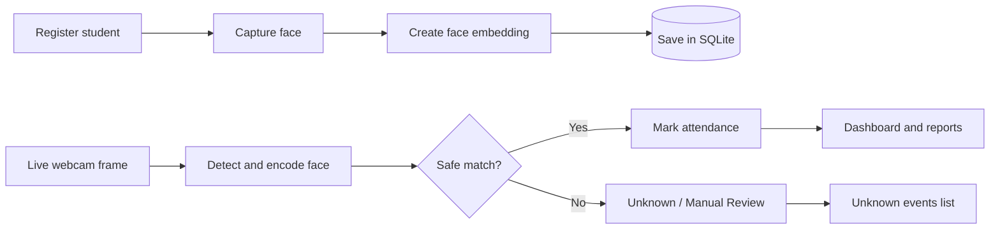
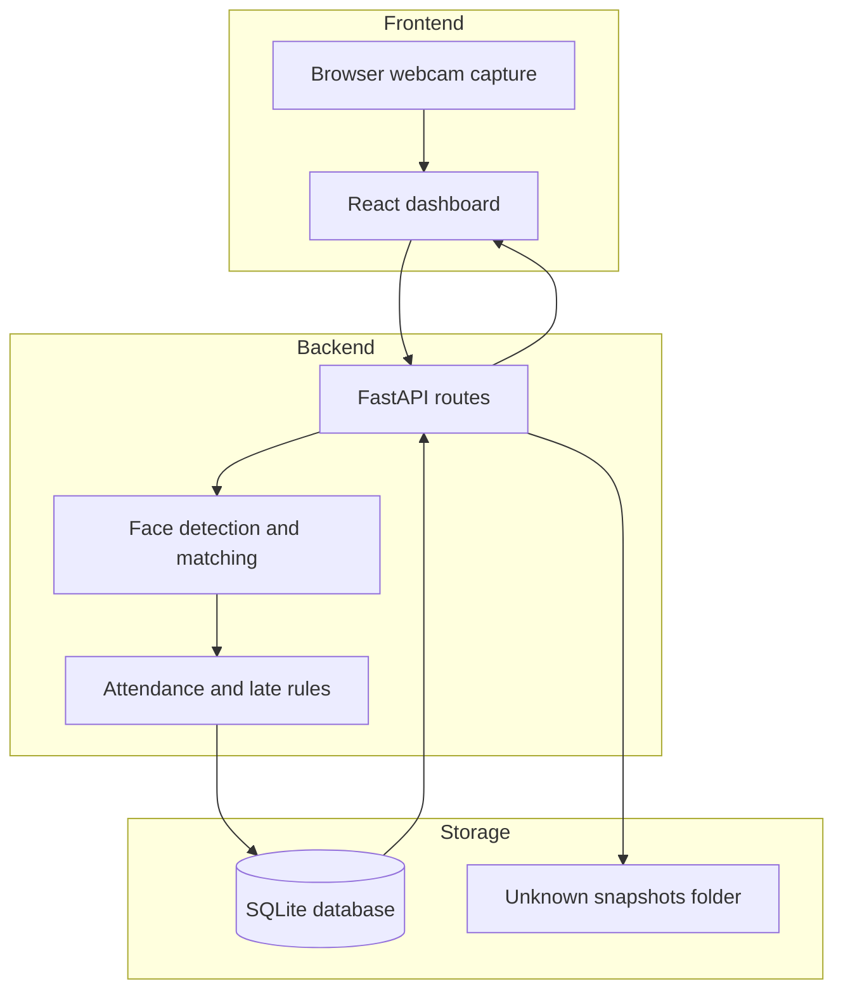

# Smart Corridor - Face Recognition Attendance System

[](https://www.python.org/)
[](https://fastapi.tiangolo.com/)
[](https://react.dev/)
[](https://www.sqlite.org/)
[](https://opencv.org/)

Smart Corridor is a focused college MVP for laptop-based biometric attendance. It uses one webcam as a corridor camera, recognizes registered students locally, and stores attendance in SQLite.

The goal is not to build a giant enterprise product. The goal is to show a clean, practical, end-to-end system: camera input, face embedding, matching logic, attendance rules, local database storage, and a usable dashboard.

## Project Highlights

- Built a complete local attendance flow using Python, FastAPI, React, OpenCV, face_recognition, and SQLite.
- Designed one simple corridor-camera workflow that runs on a single laptop.
- Added safe recognition behavior: low-confidence matches become `Unknown / Manual Review`.
- Stored attendance once per student per day with `Present`, `Late`, and `late_minutes`.
- Added dashboard views for registration, recognition, attendance reports, and unknown events.
- Kept biometric data local and ignored database/snapshot files in Git.

## Demo Workflow



## Core Features

| Area | What it does |
| --- | --- |
| Student registration | Saves student details and one face embedding from the laptop webcam. |
| Live recognition | Reads webcam frames and compares them against registered embeddings. |
| Attendance marking | Marks attendance only once per student per day. |
| Late logic | Uses configurable school start time and stores minutes late. |
| Dashboard | Shows student counts, today's attendance, late records, and review queue counts. |
| Reports | Searches attendance by date, name, roll number, or class. |
| CSV export | Exports visible attendance/report rows for offline use. |
| Unknown events | Records unsafe matches for manual review instead of marking attendance. |

## Tech Stack

| Layer | Technology |
| --- | --- |
| Frontend | React, Vite, CSS |
| Backend | Python, FastAPI |
| Computer vision | OpenCV, face_recognition |
| Database | SQLite |
| Camera | Laptop webcam |

## Architecture



## Screens

- Dashboard overview
- Student registration
- Live recognition
- Today's attendance
- Attendance report
- Unknown events review

## Database Design

| Table | Purpose |
| --- | --- |
| `students` | Stores student name, roll number, class/division, and registration time. |
| `face_embeddings` | Stores local face embeddings linked to students. |
| `attendance` | Stores date, entry time, status, and late minutes. |
| `unknown_events` | Stores low-confidence or unknown recognition events. |

## Folder Structure

```text
Smart Corridor/
|-- backend/
|   |-- app/
|   |   |-- config.py
|   |   |-- database.py
|   |   |-- face_engine.py
|   |   |-- main.py
|   |-- requirements.txt
|-- frontend/
|   |-- src/
|   |   |-- App.jsx
|   |   |-- App.css
|   |-- package.json
|-- assets/
|   |-- unknown_snapshots/
|-- data/
|-- .env.example
|-- .gitignore
|-- README.md
|-- SECURITY.md
```

## Local Setup

Create and activate the Python environment:

```powershell
cd "C:\Projects - Building\Face Recognititon"
python -m venv .venv
.\.venv\Scripts\activate
```

Install backend dependencies:

```powershell
cd "C:\Projects - Building\Face Recognititon\backend"
..\.venv\Scripts\python.exe -m pip install --upgrade pip
..\.venv\Scripts\python.exe -m pip install -r requirements.txt
```

Install frontend dependencies:

```powershell
cd "C:\Projects - Building\Face Recognititon\frontend"
npm install
```

## Run the Project

Start the backend:

```powershell
cd "C:\Projects - Building\Face Recognititon\backend"
..\.venv\Scripts\python.exe -m uvicorn app.main:app --host 127.0.0.1 --port 8000
```

Start the frontend:

```powershell
cd "C:\Projects - Building\Face Recognititon\frontend"
npm run dev
```

Open the app:

```text
http://localhost:5173
```

Check the backend:

```text
http://127.0.0.1:8000/api/health
```

## Configuration

The default school start time is `08:00`.

```env
SMART_CORRIDOR_SCHOOL_START=08:00
SMART_CORRIDOR_LATE_GRACE_MINUTES=0
```

Example:

If school starts at `08:00` and a student arrives at `08:15`, the system marks the student as `Late` and stores `15` late minutes.

## MVP Boundaries

This project intentionally stays small and realistic:

- one laptop
- one webcam
- one local SQLite database
- one corridor/entrance flow
- no cloud deployment
- no mobile app
- no multiple cameras
- no enterprise role system

## Privacy and Security

This project handles biometric-style data, so it should be treated carefully.

- Real student databases should not be pushed to GitHub.
- Unknown-person snapshots should not be pushed to GitHub.
- Face recognition is probabilistic and should not be treated as perfect.
- Unsafe matches are sent to manual review and do not mark attendance.
- The backend is intended to run locally on `127.0.0.1`.

Read more in [SECURITY.md](SECURITY.md).

## Verification Checklist

- Register one test student with a clear webcam image.
- Start live recognition and confirm the student is recognized.
- Confirm attendance is marked only once per day.
- Test late status by changing `SMART_CORRIDOR_SCHOOL_START`.
- Test unknown handling with a different face or unclear frame.
- Check today's attendance and report search.
- Export report rows to CSV.

## What I Learned

This project connects several real software engineering concepts:

- camera capture in the browser
- backend API design
- face embedding generation
- safe matching thresholds
- SQL schema design
- duplicate attendance prevention
- local privacy rules
- dashboard UI design

## Project Status

Smart Corridor is ready as a local college-project MVP and GitHub portfolio project. It demonstrates a complete full-stack workflow without claiming production-level biometric accuracy.
