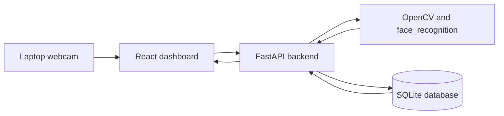

# Smart Corridor - Face Recognition Attendance System

[](https://www.python.org/)
[](https://fastapi.tiangolo.com/)
[](https://react.dev/)
[](https://www.sqlite.org/)
[](https://opencv.org/)

Smart Corridor is a local laptop-based attendance MVP for one school entrance or corridor camera. A React dashboard captures webcam frames, a Python API performs face matching, and SQLite stores student and attendance records on the same laptop.

This project does not claim perfect face recognition accuracy. If the match is not safe, the system shows `Unknown / Manual Review` and does not mark attendance.

## Features

- Register students with name, roll number, class/division, and webcam face capture.
- Store face embeddings locally in SQLite.
- Recognize students from one laptop webcam flow.
- Mark attendance only once per student per day.
- Mark `Present` or `Late` using configurable school timing.
- Store late minutes for attendance reports.
- Show unknown-person events for manual review.
- Search attendance reports and export visible report rows to CSV.

## Architecture



## Tech Stack

- Python
- FastAPI
- OpenCV
- face_recognition
- SQLite
- React
- Vite

## Project Structure

```text
Smart Corridor/
|-- backend/
|   |-- app/
|   |-- requirements.txt
|-- frontend/
|   |-- src/
|   |-- package.json
|-- assets/
|   |-- unknown_snapshots/
|-- data/
|-- .env.example
|-- .gitignore
|-- README.md
|-- SECURITY.md
```

## Database Tables

- `students`: student profile details.
- `face_embeddings`: saved biometric face embeddings.
- `attendance`: attendance date, entry time, status, and late minutes.
- `unknown_events`: faces that were detected but not safely recognized.

## Local Setup

Create a virtual environment:

```powershell
cd "C:\Projects - Building\Face Recognititon"
python -m venv .venv
```

Install backend packages:

```powershell
cd "C:\Projects - Building\Face Recognititon\backend"
..\.venv\Scripts\python.exe -m pip install --upgrade pip
..\.venv\Scripts\python.exe -m pip install -r requirements.txt
```

Install frontend packages:

```powershell
cd "C:\Projects - Building\Face Recognititon\frontend"
npm install
```

## Run Locally

Start the backend:

```powershell
cd "C:\Projects - Building\Face Recognititon\backend"
..\.venv\Scripts\python.exe -m uvicorn app.main:app --host 127.0.0.1 --port 8000
```

Start the frontend:

```powershell
cd "C:\Projects - Building\Face Recognititon\frontend"
npm run dev
```

Open the dashboard:

```text
http://localhost:5173
```

Backend health check:

```text
http://127.0.0.1:8000/api/health
```

## Configuration

The default school start time is `08:00`.

```env
SMART_CORRIDOR_SCHOOL_START=08:00
SMART_CORRIDOR_LATE_GRACE_MINUTES=0
```

- `SMART_CORRIDOR_SCHOOL_START`: official entry time in `HH:MM` format.
- `SMART_CORRIDOR_LATE_GRACE_MINUTES`: optional grace period before a student is marked late.

## Privacy Notes

Keep this project local when using real student data.

- Do not push the SQLite database to GitHub.
- Do not push unknown-person snapshots to GitHub.
- Do not store real face embeddings in a public repository.
- Do not use the system as the only proof of attendance without human review.

See [SECURITY.md](SECURITY.md) for more notes.

## Project Status

This is a college MVP and local prototype. It is ready for demo use on one laptop with one webcam, after registering test students locally.
